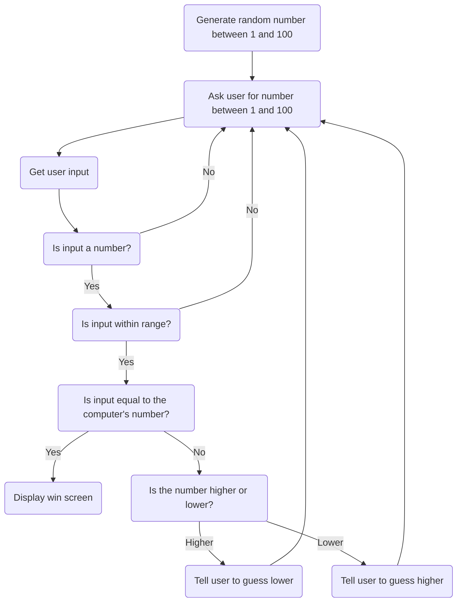

```mermaid

flowchart TD
    A(Generate random number between 1 and 100)
    A --> B(Ask user for number between 1 and 100)
    B --> C(Get user input)
    C --> D(Is input a number?)
    D -->|No| B
    D -->|Yes| F(Is input within range?)
    F -->|No| B
    F -->|Yes| H(Is input equal to the computer's number?)
    H -->|Yes| J(Display win screen)
    H -->|No| I(Is the number higher or lower?)
    I -->|Higher| K(Tell user to guess lower)
    I -->|Lower| L(Tell user to guess higher)
    K --> B
    L --> B

```
