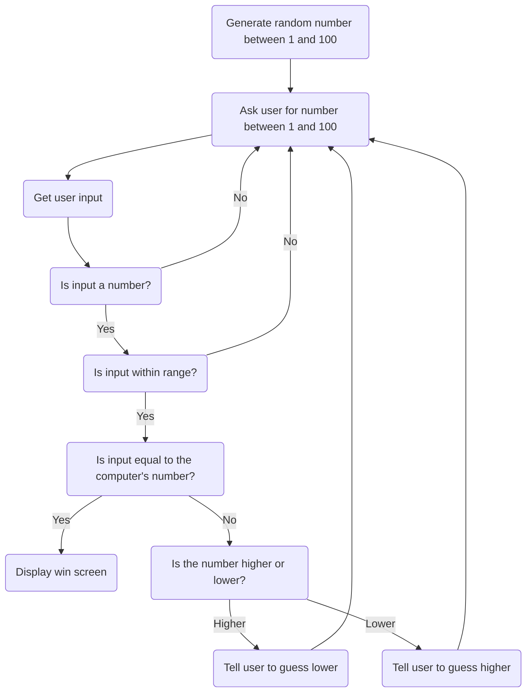

### Guessing Game Diagram  
    This diagram shows how a guessing game could function. In this game, the computer would generate a random number between 1 and 100, and then the user would be prompted to guess repeatedly until they can figure out the computer's number. If the user inputs a number between 1 and 100, then the computer would cross-reference it with it's own number. Then the computer would tell the user whether their input was too high or too low, and prompt the user to guess again.  
    If the user inputs an invalid number, outside the range of 1 to 100, then the computer would prompt it to guess again. The same goes for if the user decides to input an invalid character, like a letter.
